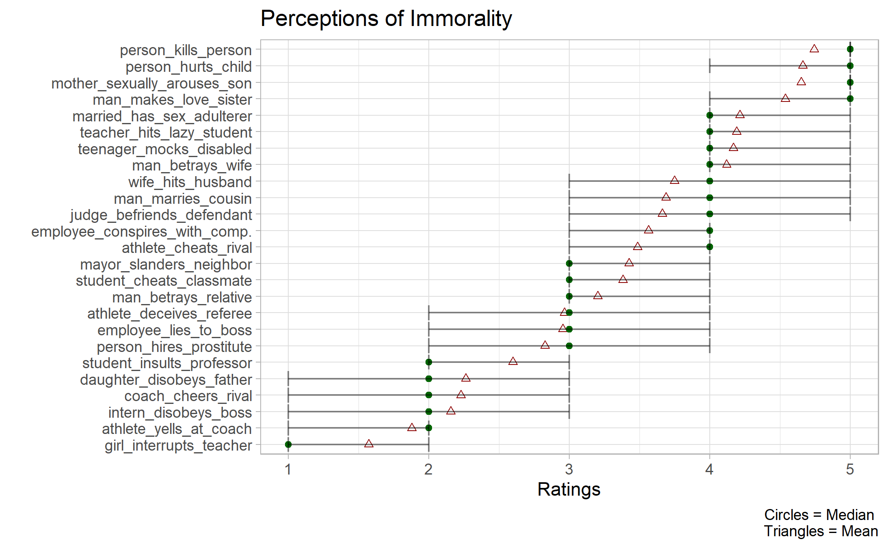
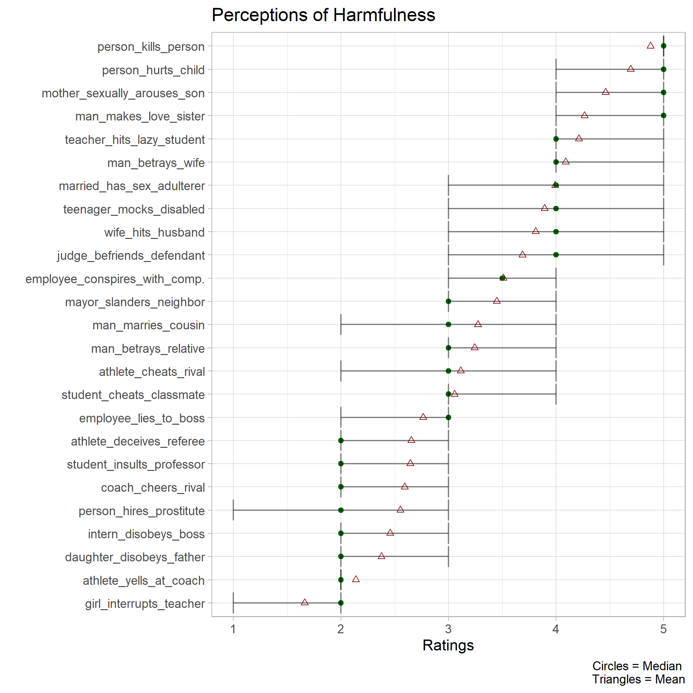
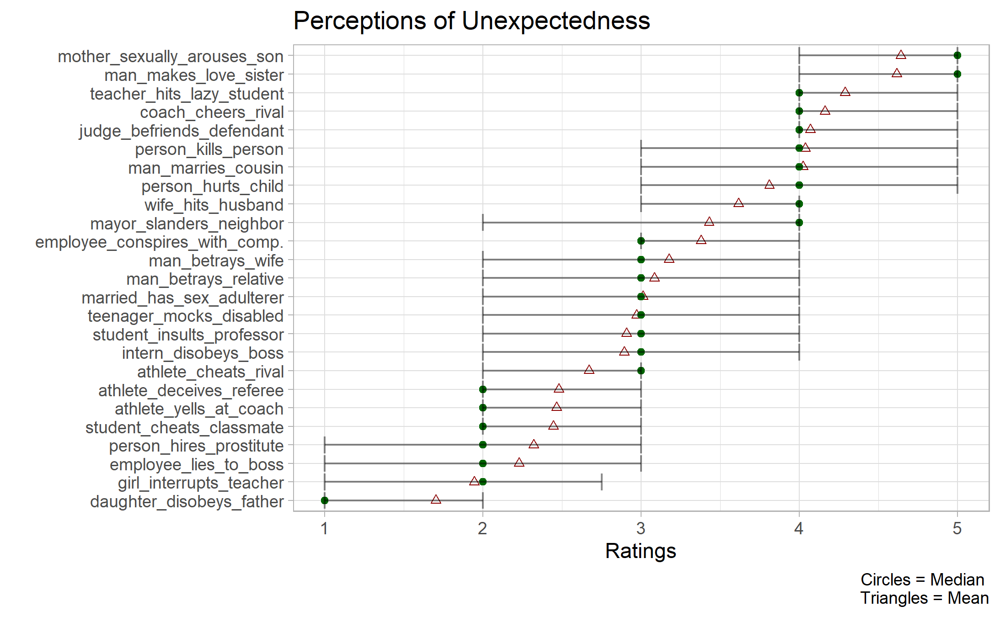
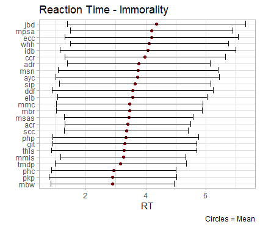
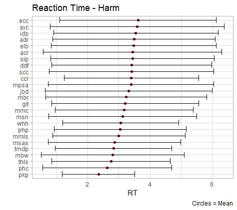

```{r setup, include=FALSE}
knitr::opts_chunk$set(echo = TRUE)
```

```{r, include=FALSE}
library(tidyverse)
```

## Study 1 

Here, I present figures showing the distribution of the data collected in study one. Here, are the ratings for the immorality of scenarios, their harmfulness, and their unexpectedness: 

{height=100%}



{height=100%}

## Study 2 

Next, I present the descriptive plots for the reaction time data collected in Study 2. 

{width=90%}

{width=90%}

